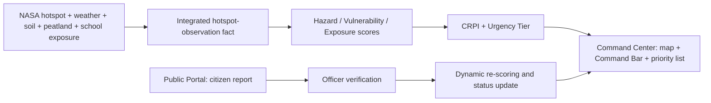

# PART B — DATA SCIENCE & ANALYTICS
## Section 10. Data Visualization Specification

**Project:** FIRELINE — Decision Support System for Wildfire Mitigation  
**Team:** Alpha  
**Purpose:** Menjelaskan bagaimana hasil Data Science ditampilkan pada dashboard Command Center, map, dan Public Portal.

## 10.1 Design objective

Dashboard FIRELINE dirancang untuk membantu petugas menjawab tiga pertanyaan utama:

1. Di mana lokasi api yang paling perlu diperhatikan?
2. Mengapa lokasi tersebut memiliki prioritas tinggi?
3. Tindakan apa yang perlu dilakukan dan bagaimana prioritas berubah setelah laporan warga diverifikasi?

Desain menggunakan pendekatan **map-first, explainable, dan action-oriented**. Peta menunjukkan lokasi dan konsentrasi risiko, sedangkan tabel dan kartu KPI menerjemahkan hasil analitik menjadi antrean tindakan.

## 10.2 Data sources and analytical grain

Sumber utama untuk prototype dashboard adalah [`fireline_master_analytical_labeled_2024_2026.csv`](../datasets/fireline_master_analytical_labeled_2024_2026.csv), dengan satu baris untuk satu observasi hotspot NASA dan 61.583 baris.

Sumber pendukung:

- Weather operasional: [`bmkg_kalimantan_weather_2024_2026.csv`](../datasets/bmkg_kalimantan_weather_2024_2026.csv).
- Soil moisture: [`kalimantan_peat_soil_moisture_2024_2026.csv`](../datasets/kalimantan_peat_soil_moisture_2024_2026.csv).
- Fasilitas sekolah: [`data4_schools_cleaned_kalimantan.csv`](../datasets/processed/data4_schools_cleaned_kalimantan.csv).
- Layer gambut: [`kalimantan_peatland_spatial.geojson`](../datasets/kalimantan_peatland_spatial.geojson).
- Citizen report: dummy untuk demo terlebih dahulu, kemudian diganti dengan input live setelah Public Portal dipublikasikan.

Identifier utama pada fase ini adalah `detection_id`. Identifier tersebut menunjukkan observasi hotspot, bukan incident/event yang telah dikelompokkan.

> **Status data:** Rancangan ini siap digunakan sebagai desain prototype. Sebelum diperlakukan sebagai dashboard production, weather threshold, admin fallback, validasi soil/peat, dan formula CRPI perlu disetujui ulang oleh DS dan SEA.

## 10.3 Dashboard-to-action flow



Alur ini memisahkan dua hal: skor awal berbasis data observasi dan pembaruan skor setelah laporan citizen diverifikasi. Laporan yang belum diverifikasi tidak langsung mengubah CRPI.

## 10.4 Dashboard structure

| Tab | Name | Main user | Main output | Phase |
|---|---|---|---|---|
| 1 | Executive Command Center & CRPI Prioritization | BPBD / Command Center | Situation summary, risk map, priority queue | Prototype using master |
| 2 | Hazard & Fire Severity | Satellite/data analyst | Thermal severity, FRP, peatland context | Prototype; chronic grid needs certified view |
| 3 | Meteorology & Climate Vulnerability | Climate/operations analyst | Dryness, weather, soil, baseline climate | Prototype with source caveats |
| 4 | Human Exposure & Vital Facilities | Protection/public-service officer | School exposure and facility watchlist | Aggregate prototype |
| 5 | Dynamic Re-scoring & Ground-Truth Verification | Verification officer / field team | Citizen-report workflow and score changes | Dummy first, live after publication |

## 10.5 Tab 1 — Executive Command Center & CRPI Prioritization

### Layout

```text
┌──────────────────────────────────────────────────────────────────┐
│ COMMAND BAR: Active Hotspots | Tier-1 | High-Risk Area | Mean CRPI│
├───────────────────────────────────────┬──────────────────────────┤
│                                       │ Risk breakdown           │
│  Interactive risk map                 │ Hazard                   │
│  - peatland underlay                  │ Vulnerability            │
│  - weighted heatmap                   │ Exposure                 │
│  - hotspot points                     │ Urgency distribution     │
│  - emergency zones                    │                          │
├───────────────────────────────────────┴──────────────────────────┤
│ INCIDENT PRIORITY LIST — sorted by CRPI, then operational date    │
└──────────────────────────────────────────────────────────────────┘
```

### A. Command Bar aggregation

Five summary cards are displayed at the top of the page. The first four are quantitative; the fifth is a status badge.

| Card | Definition | Current field/source |
|---|---|---|
| Active Hotspots | `COUNTD(detection_id)` for the selected date and filters | `detection_id`, `operational_date` |
| Critical Tier-1 | Count of observations where `crpi_score >= 80` | `crpi_score` / `urgency_tier` |
| High-Risk Area | Count of high-risk administrative areas | Planned: district/kabupaten; currently use province only or mark unavailable |
| Mean CRPI | Average `crpi_score` for the selected scope | `crpi_score` |
| Emergency Status | SIAGA 1, SIAGA 2, WASPADA, or AMAN based on approved thresholds | `urgency_tier`; rule requires DS/SEA approval |

For a prototype, the card must display the selected date scope. A card must not be described as “active” in real time when it is calculated from a historical static extract.

### B. Risk layer and heatmap

The map contains four visual layers:

1. **Base geography:** Kalimantan boundary and province boundaries.
2. **Peatland underlay:** semi-transparent polygons from `kalimantan_peatland_spatial.geojson`; darker brown indicates deeper peat.
3. **Risk density heatmap:** a weighted spatial density layer where higher `crpi_score` contributes more intensity. The colour scale is transparent/low risk → yellow → orange → dark red.
4. **Individual hotspot points:** point size represents `frp`; point colour represents urgency tier.

The heatmap is for identifying clusters, not for counting incidents. Incident counts must come from distinct `detection_id` values.

### C. CRPI visualization and risk breakdown

Each selected hotspot has a compact risk breakdown:

```text
CRPI 72.4 — TIER 2: HIGH
Hazard         ███████████░░  64
Vulnerability  █████████░░░░  51
Exposure       ████████████░  78
```

The production concept uses:

```text
CRPI = 0.35 × Hazard + 0.25 × Vulnerability + 0.40 × Exposure
```

The current values are displayed from the upstream master fields `hazard_score`, `vulnerability_score`, `exposure_score`, and `crpi_score`. Tableau should display the component values and not silently recompute a different formula.

### D. Incident Priority List

The lower section shows the action queue sorted by:

1. `crpi_score` descending;
2. `urgency_tier` ascending by severity;
3. `operational_date` descending;
4. `frp` descending as a tie-breaker.

Recommended columns:

| Column | Purpose |
|---|---|
| `detection_id` | Stable reference to the hotspot observation |
| `operational_date`, `acq_time` | Operational timing and traceability |
| `province_name` | Geographic filter and grouping |
| latitude, longitude | Map navigation |
| `frp`, `confidence`, `temp_delta` | Thermal evidence |
| `is_peatland`, `peat_depth`, `nama_khg` | Peatland context |
| `station_dist_km`, `weather_available` | Weather coverage context |
| `nearest_school_distance_km`, `schools_within_5km` | Exposure context |
| `hazard_score`, `vulnerability_score`, `exposure_score`, `crpi_score` | Explainable risk score |
| `urgency_tier`, `rekomendasi_taktis` | Operational action |

`district_name`, `incident_id`, and population-exposure fields should be added only after a validated source exists. They should not be fabricated from the current master.

## 10.6 Tab 2 — Hazard & Fire Severity

This tab explains the physical evidence behind the priority score.

### Recommended visualizations

1. **FRP vs. temperature anomaly scatter plot**
   - X-axis: `temp_delta`.
   - Y-axis: `frp`, preferably log-scaled.
   - Colour: NASA `confidence`.
   - Size: `frp` or selected risk score.

2. **Peatland versus mineral comparison**
   - Boxplots or bars for FRP, temperature anomaly, soil moisture, and hazard score.
   - Use `is_peatland` as the comparison dimension.

3. **Confidence and day/night distribution**
   - Stacked bar or heatmap using `confidence` and `daynight`.
   - Purpose: show the sensor observation profile and possible detection blind spots.

4. **Chronic fire zone map**
   - Intended output: grid-month recurrence map with the top chronic zones.
   - This requires a separately certified grid aggregation. The current master does not contain the stated chronic-grid table, so it is marked as a planned/conditional visual.

## 10.7 Tab 3 — Meteorology & Climate Vulnerability

This tab explains how atmospheric and soil conditions can increase fire spread and fuel dryness.

### Recommended visualizations

1. **Hotspot and weather timeline**
   - Daily hotspot count as bars.
   - VPD, temperature, humidity, precipitation, and soil moisture as lines.
   - Use `operational_date` consistently and label it as WIB-derived date.

2. **Dryness indicator cards**
   - Temperature maximum.
   - Minimum relative humidity.
   - VPD maximum.
   - Precipitation.
   - Soil moisture 0–7 cm.

3. **Station coverage map**
   - Show station city and hotspot-to-station distance.
   - Flag observations beyond the approved 200 km threshold rather than hiding them.

4. **Historical climate baseline**
   - Compare the 2010–2020 station baseline with the current operational period.
   - This is a contextual comparison, not a direct row-level join to each hotspot.

The dashboard specification mentions a 14-day drought feature. Because `Drought14d_Norm` is not currently present in the master, the prototype should label this as “pending upstream feature” or use only the available `is_dry_day` field without claiming a 14-day result.

## 10.8 Tab 4 — Human Exposure & Vital Facilities

This tab translates a hotspot into potential exposure of public facilities.

### Recommended visualizations

1. **School facility map**
   - School points from the cleaned Kalimantan school source.
   - Colour by school stage or exposure band.
   - Hotspots are shown as a separate layer.

2. **Exposure distance bands**
   - Direct danger: 0–1 km.
   - Smoke concern: 1–3 km.
   - Monitoring buffer: 3–5 km.

   These bands are presentation zones and should not be described as official evacuation orders without authority approval.

3. **School exposure watchlist**
   - Nearest school name and stage.
   - Distance to hotspot.
   - Number of schools within 5 km and 10 km.
   - Related `detection_id` and urgency tier.

4. **Area-level exposure summary**
   - Province-level counts are safe when calculated from the hotspot fact.
   - District-level population exposure requires a certified hotspot-to-school aggregation. Until then, it should be marked as unavailable rather than estimated in Tableau.

## 10.9 Tab 5 — Dynamic Re-scoring & Ground-Truth Verification

Tab 5 will use dummy data during the competition/demo phase and live citizen reports after publication.

### A. Verification pipeline funnel

```text
Report received → Under review → Verified valid → Actioned → Resolved
                               ↘ Rejected / false alarm
```

The funnel shows workflow volume, not fire severity. Dummy data must display the label **SIMULATION — NOT LIVE DATA**.

### B. Before-and-after re-scoring matrix

| Field | Before verification | After verification |
|---|---|---|
| CRPI | `crpi_initial` | `crpi_updated` |
| Urgency | Initial tier | Updated tier |
| Evidence | Satellite observation | Satellite + verified citizen report |
| Status | Pending | Verified/actioned/resolved |

The visual should highlight changes such as `Tier 3 → Tier 1`, but it must not imply that the change came from real citizen behaviour while dummy data is being used.

### C. Satellite versus citizen-report map

- NASA hotspot: circular red/orange symbol.
- Citizen report: blue marker.
- Verified report: blue marker with check icon.
- Rejected report: grey marker.
- Link line: shown only when the report has been matched to a `detection_id`.

The proposed initial spatial matching tolerance is 5 km, subject to DS/SEA validation.

### D. Response/SLA cards

The live version may show report-to-verification and verification-to-dispatch time. The dummy version should show example workflow values only and label them simulated.

Minimum future fields include `report_id`, `report_timestamp`, citizen coordinates, `verification_status`, `verified_by`, `verified_at`, `detection_id`, `crpi_initial`, `crpi_updated`, `dispatch_status`, `resolution_status`, and `last_updated`.

## 10.10 Emergency zones and operational symbology

For Tier 1 and Tier 2 observations, the map may show three concentric operational zones:

| Zone | Radius | Meaning in dashboard | Example response |
|---|---:|---|---|
| Direct danger | 1 km | Potential direct fire contact | Immediate field assessment / evacuation decision |
| Smoke concern | 3 km | Potential concentrated smoke exposure | School/public-space protection measures |
| Monitoring buffer | 5 km | Wider watch area | Monitor wind, spread, and exposed facilities |

These circles are decision-support overlays. They are not a legal evacuation boundary and should be combined with field verification, wind information, local authority decisions, and public-health guidance.

## 10.11 Global controls and interactions

Recommended controls:

- Date selector: `operational_date`; expose `acq_date` separately for NASA traceability.
- Province filter: `province_name` after the admin policy is approved.
- Urgency filter: Tier 1–4.
- Peatland filter: mineral, peatland, and peat-depth class.
- Confidence and day/night filters.
- FRP, CRPI, station distance, and school-distance ranges.

Recommended interactions:

- Selecting a map point filters the priority list and risk breakdown.
- Selecting a tier filters map points and Command Bar summaries.
- Selecting a province updates all cards and charts.
- Selecting a row opens a detail view using `detection_id`.
- Tab 5 verification actions update status and re-scoring only after an authorised verification event.

## 10.12 Colour and accessibility guide

| Meaning | Colour | Label |
|---|---|---|
| Tier 1 | Dark red | Critical |
| Tier 2 | Orange | High |
| Tier 3 | Yellow/amber | Medium |
| Tier 4 | Green/blue-grey | Low |
| Peatland underlay | Brown/amber hatch | Peatland context |
| Citizen report | Blue | Report |
| Rejected report | Grey | Rejected |

Every colour must be accompanied by a text label or shape difference so that the dashboard remains understandable without colour perception.

## 10.13 Supporting visual — dashboard wireframe

The following simplified wireframe can be used as the supporting visual for this section:

```text
COMMAND CENTER — FIRELINE
────────────────────────────────────────────────────────────────────
[Active Hotspots] [Tier 1] [High-Risk Area] [Mean CRPI] [SIAGA]
────────────────────────────────────────────────────────────────────
│                    RISK MAP                         │ BREAKDOWN │
│  peatland underlay                                  │ Hazard    │
│  weighted heatmap                                   │ Vulnerab. │
│  tier-coloured hotspots                             │ Exposure  │
│  1/3/5 km zones                                     │ Tier mix  │
──────────────────────────────────────────────────────┴─────────────
INCIDENT PRIORITY LIST
ID | Date | Province | FRP | Peat | School distance | CRPI | Tier | Action
────────────────────────────────────────────────────────────────────
```

## 10.14 Implementation boundary and limitations

The visualization layer should display certified upstream outputs; it should not become the place where production joins or risk formulas are silently re-created.

Current limitations to disclose in the report or dashboard documentation:

- The master contains `detection_id` but no approved `event_id` or `incident_id`.
- District/kabupaten and population exposure are not currently certified in the master.
- `Drought14d_Norm` and 25 km school counts are not currently available in the master.
- Weather availability beyond the 200 km station threshold requires correction or an approved exception.
- Tab 5 is simulated until the Public Portal receives real citizen reports.
- CRPI fields and thresholds are analytical outputs under DS/SEA review; any published formula must include a version and calculation timestamp.

## 10.15 Expected user outcome

After using the dashboard, a Command Center officer should be able to:

1. identify the highest-priority hotspot from the map and priority list;
2. see the hazard, vulnerability, and exposure factors behind its CRPI;
3. understand nearby peatland and school exposure context;
4. choose an initial response tier and tactical recommendation;
5. verify a citizen report later and see how the operational priority changes.

