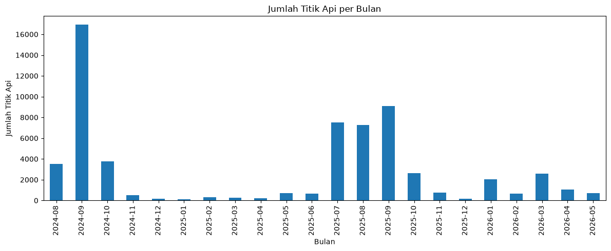
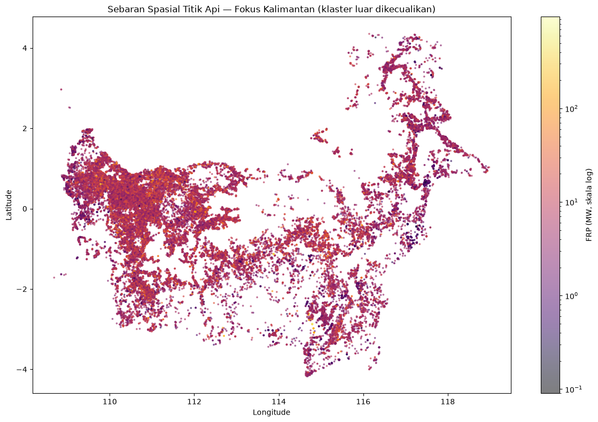
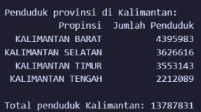
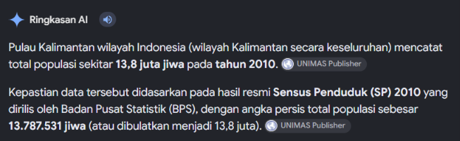
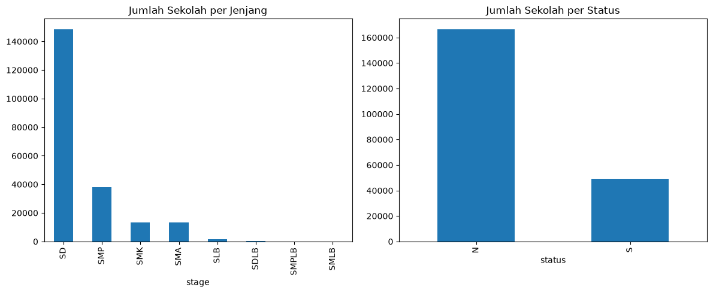
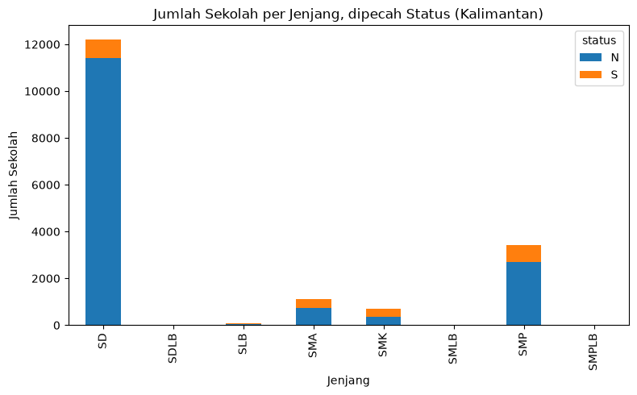
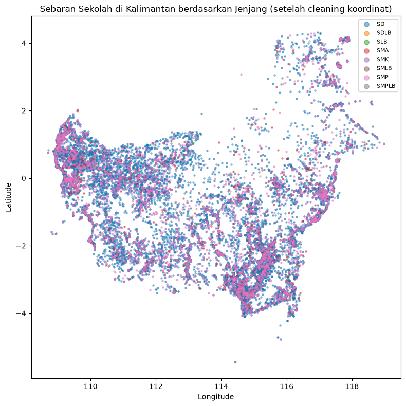

# Temuan Analisis Data Awal (1, 3, 4) — FIRELINE

## 1. Konteks Singkat

FIRELINE adalah platform untuk membantu *command center* (BPBD, Manggala Agni, Pemda) memutuskan titik api mana yang paling mendesak untuk direspons di Kalimantan, dengan mempertimbangkan siapa saja yang berisiko terdampak (penduduk, anak sekolah, fasilitas vital).

Dokumen ini merangkum apa yang ditemukan setelah membedah tiga dataset mentah untuk memberi gambaran yang sama ke anggota lain.

## 2. Dataset yang Dianalisis

| Dataset | Isi | Ukuran | Tahun Data |
|---|---|---|---|
| Titik api (NASA FIRMS) / Dataset utama | Lokasi & intensitas titik panas dari satelit | ~61.500 titik | Agustus 2024 - Mei 2026 |
| Populasi Provinsi / Dataset 3 | Jumlah penduduk per provinsi | 32 provinsi | 2010 (tidak dipakai, lihat poin 4) |
| Sekolah + BPS / Dataset 4 | Lokasi sekolah & data populasi per provinsi | ~215.000 sekolah | 2022 |

## 3. Temuan Kunci

### Titik Api (NASA FIRMS) / Dataset Utama

- **Polanya sangat musiman.** Titik api melonjak tajam di bulan Agustus-Oktober, konsisten dua tahun berturut-turut (2024 & 2025). Ini mengonfirmasi narasi "musim kering" yang jadi latar belakang di problem description FIRELINE.

- **2024 jauh lebih parah dari 2025**. Puncak September 2024 hampir dua kali lipat puncak tahun berikutnya. Bisa jadi bahan diskusi dengan target pengguna: apakah *command center* punya cara membedakan "musim biasa" vs "musim krisis" saat ini?
- **Sebagian besar titik api sebenarnya kecil**, hanya segelintir yang benar-benar besar/intens. Berarti sistem prioritas nanti perlu bisa membedakan "titik api besar di tengah hutan kosong" vs "titik api kecil dekat permukiman", bukan cuma mengurutkan berdasarkan ukuran api semata.

- **Keterbatasan sensor** dimana sekitar 4% titik api tercatat menyentuh "batas maksimum" alat ukur satelit, tepatnya di suhu kecerahan 367 Kelvin, artinya untuk titik-titik terpanas ini, intensitas sebenarnya bisa jadi lebih tinggi dari yang tercatat, bukan angka suhu asli. Ini bukan dugaan saya semata, dikonfirmasi oleh dokumentasi teknis resmi NASA bahwa kanal inframerah utama yang dipakai VIIRS untuk mendeteksi api memang punya ambang saturasi baku di titik tersebut, sehingga di atas nilai itu sensor tidak lagi bisa membedakan seberapa panas api yang sebenarnya (lihat Sumber [1][2] di bagian akhir dokumen). Perlu jadi catatan *disclaimer* di produk, bukan dianggap angka pasti.

### Populasi Provinsi (SP2010) / Dataset 3 - Tidak Digunakan Aktif

Dataset ini awalnya dimaksudkan untuk memberi konteks jumlah penduduk. Namun setelah dicek, datanya berasal dari sensus 2010 alias sudah 15+ tahun, dan ternyata dataset Sekolah / Dataset 4 (poin berikutnya) sudah punya angka populasi yang lebih baru (2022). Karena itu, dataset ini tidak dipakai aktif di analisis dan hanya disimpan sebagai referensi historis, demi transparansi bahwa data ini ada tapi sengaja tidak dipakai.

<table>
<tr>
<td></td>
<td></td>
</tr>
</table>

*(Gambar di kiri merupakan output dari notebook untuk melihat penduduk per provinsi di Kalimantan beserta total, sedangkan gambar di kanan merupakan hasil cross-check untuk tahun berapa Kalimantan memiliki total penduduk sekitar 13,8 juta jiwa)*

### Sekolah + Populasi (BPS 2022) / Dataset 4

- **Populasi usia sekolah** (anak & remaja usia pendidikan) tersedia per provinsi yang berguna untuk melihat provinsi mana yang punya jumlah kelompok rentan (anak-anak) paling besar secara struktural.
- **Sekolah Dasar (SD) mendominasi** jumlah fasilitas pendidikan (140.000+ dari total sekolah), diikuti SMP. Ini relevan karena SD berarti populasi anak usia dini, kelompok yang secara medis paling rentan terhadap paparan asap kebakaran dan ISPA secara fisiologis.

*(N = Negeri, S = Swasta)*

- **Sekolah berkebutuhan khusus (SLB dan sejenisnya) jumlahnya sangat kecil**, tapi jadi poin penting untuk digali: sekolah semacam ini biasanya butuh proses evakuasi yang lebih kompleks meski jumlahnya sedikit karena bobot risikonya tidak bisa disamakan dengan jumlah murni.
- **Lokasi (koordinat) sekolah cukup lengkap**. Dari ~215.000 sekolah, hanya sekitar 1% yang datanya bermasalah (kosong atau salah input), dan sudah ditandai/*flag* (bukan menghapus) baris-baris tersebut supaya tidak hilang datanya untuk kebutuhan non-spasial.
- Setelah dibersihkan dan di filter untuk fokus hanya pada Pulau Kalimantan, sebaran lokasi sekolah di Kalimantan sudah bisa divisualisasikan dan membentuk pola yang jelas.

## 4. Keputusan Kualitas Data

| Isu | Keputusan | Alasan Singkat |
|---|---|---|
| Populasi provinsi 2010 vs 2022 | Pakai yang 2022 (dari dataset sekolah), yang 2010 didokumentasikan saja | Lebih relevan/akurat untuk kondisi saat ini |
| Titik api dengan intensitas ekstrem | Tetap disimpan, tidak dianggap "outlier untuk dibuang" | Titik api besar justru sinyal penting, bukan noise |
| Sekolah tanpa koordinat valid (~1%) | Ditandai, tidak dihapus | Data lain di baris itu (jenjang, status) tetap berguna |
| Data ganda (duplikat entri sekolah, <0,1%) | Dihapus | Murni redundan, tidak menambah informasi |

## 5. Implikasi untuk Riset Lapangan

Beberapa asumsi dari data ini perlu divalidasi langsung ke pengguna (petugas BPBD/Manggala Agni, warga terdampak):

1. **Prioritas dispatch saat ini**: apakah petugas benar-benar kesulitan membedakan "titik api besar tapi jauh dari permukiman" vs "titik api kecil tapi dekat sekolah/desa"? Ini asumsi inti FIRELINE yang perlu dikonfirmasi langsung.
2. **Kesiapan evakuasi sekolah berkebutuhan khusus**: data menunjukkan jumlahnya kecil, tapi kita tidak tahu dari data ini bagaimana kesiapan evakuasi mereka sebenarnya di lapangan. Ini pertanyaan riset primer, tidak bisa dijawab data.
3. **Pola musim krisis vs musim biasa**: apakah *command center* sudah punya cara membedakan kedua kondisi ini, atau selama ini menyamaratakan respons?
4. **Kepercayaan terhadap data satelit**: mengingat ada keterbatasan sensor (4% titik "mentok" di batas maksimum alat), apakah petugas lapangan sudah punya cara lain untuk memverifikasi intensitas api secara manual?

## 6. Batasan yang Perlu Diingat

Dari hasil analisis, ada beberapa batasan yang perlu diingat antara lain:

- Data populasi (baik yang aktif dipakai) masih di level provinsi, bukan kecamatan/desa, jadi belum bisa menjawab "desa mana persis yang paling berisiko", baru sebatas "provinsi mana yang butuh perhatian lebih".
- Analisis per tanggal 29 Agustus 2026 ini belum menggabungkan ketiga dataset menjadi satu skor risiko terpadu. Akan dilakukan di tahap berikutnya, di luar cakupan dokumen ini.
- Ada sedikit inkonsistensi penamaan provinsi antar dataset (misal nama lama vs baru) yang perlu diselaraskan di tahap integrasi teknis, tidak memengaruhi kesimpulan di dokumen ini.

## 7. Tahap Selanjutnya (Belum Dikerjakan)

Rencana selanjutnya yaitu:

- Integrasi/penggabungan ketiga dataset (dan data cuaca, lahan gambut, laporan masyarakat dari temen-temen DS lain).
- Perhitungan skor prioritas risiko gabungan.
- Riset lapangan primer oleh tim untuk validasi asumsi di bagian 5.

## 8. Sumber Referensi

1. Schroeder, W., et al. (2014). *The New VIIRS 375 m Active Fire Detection Data Product: Algorithm Description and Initial Assessment.* Remote Sensing of Environment, 143, 85–96. Tersedia di: https://www.earthdata.nasa.gov/s3fs-public/2022-02/Schroeder_et_al_2014b_RSE.pdf
2. NASA Earthdata. *Collection 2 VIIRS 375 m Active Fire User Guide.* Tersedia di: https://www.earthdata.nasa.gov/s3fs-public/2025-06/VIIRS_C2_AF-375m_User_Guide_1.2.pdf
